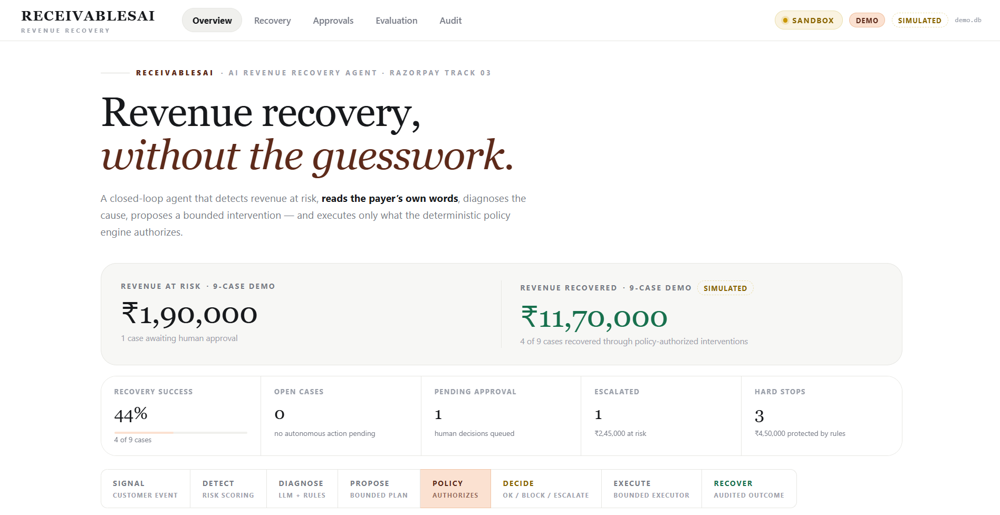
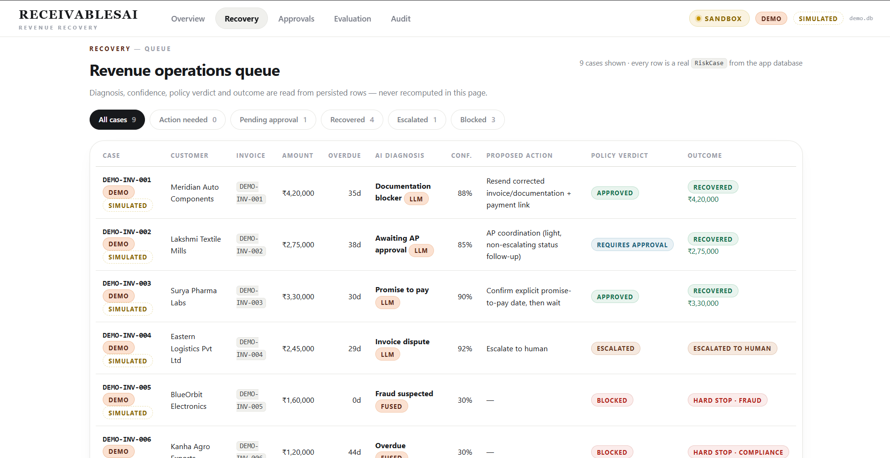
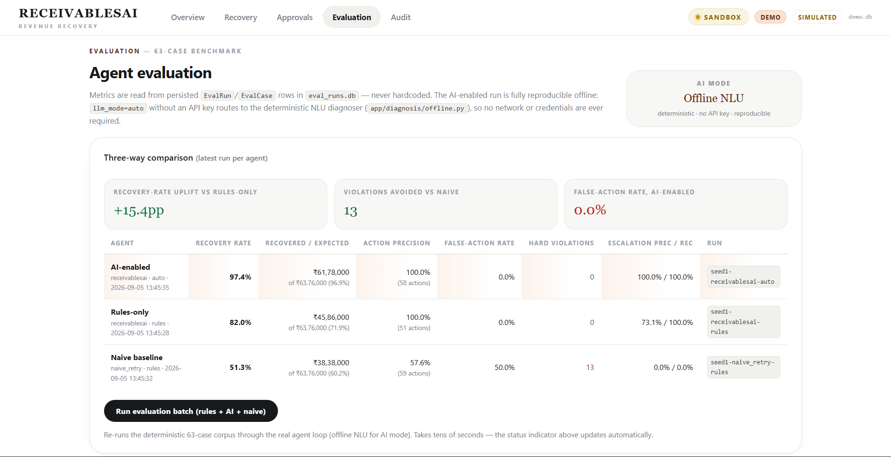
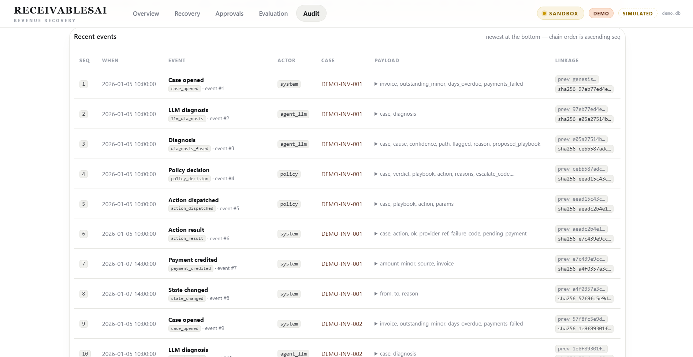

# ReceivablesAI

**A closed-loop AI revenue-recovery agent for B2B receivables** — built for the Razorpay AI Buildathon 2026, Track 03: *AI Revenue Recovery*.

The agent detects revenue at risk (failed payments, overdue invoices), diagnoses *why* the money has not arrived — reading both structured payment signals and **unstructured customer communication** (emails, AP threads, promise messages) — proposes a bounded intervention, and executes **only** what a deterministic policy engine authorizes. Every decision and every action lands in a tamper-evident, SHA-256 hash-chained audit log.

> **AI proposes. Policy decides. Executor acts. Audit records.**

---

## Problem

In B2B collections, most revenue is lost not to customer refusal but to *context*: a payer whose GST number is wrong on the invoice, an invoice sitting in a customer's AP queue, an explicit promise on a specific date, or a genuine dispute. A generic reminder bot cannot read any of this; an unconstrained AI agent that *can* read it is dangerous if it can act on its own. ReceivablesAI solves both halves: an AI diagnoser extracts meaning from unstructured context, and a deterministic policy engine — compliance, fraud, DNC, bankruptcy, age and stopping rules — decides what, if anything, may execute.

## Solution

```
Customer Signal (payment.failed / overdue / webhook)
  → Risk Detection (risk score, case lifecycle)
  → AI Diagnosis (deterministic rules classifier + NLU/LLM over redacted snapshot)
  → Fusion (LLM carries when rules abstain; disagreements never auto-act)
  → Policy Engine (compliance → fraud → stopping rules → gates)
  → Bounded Executor (whitelisted actions, idempotency keys)
  → Hash-chained Audit Log (append-only, tamper-evident)
```

The LLM (or its deterministic offline stand-in) **only proposes**. The policy engine is the sole authorizer of side effects; the executor runs approved actions exactly once.

## Key capabilities

- **Structured + unstructured diagnosis** — payment error codes classify deterministically; customer emails/AP communication are interpreted by the NLU diagnoser. The rules classifier *abstains* (`insufficient_context`) rather than guess when free text carries the answer (`app/diagnosis/rules_classifier.py`).
- **Deterministic hard stops that no AI can override** — compliance (DNC, bankruptcy, legal hold, >120 days), fraud (AVS mismatch, repeated auth failures, fraud-lock signals), stopping rules (attempt caps, cooldowns, contact window 09:00–21:00, per-customer and global budgets). See `app/policy/rules.py`.
- **Human approval workflow** — supervised mode parks every action as `PENDING_APPROVAL`; Approve/Decline goes through `app.agent.decide_approval()`; pending approvals auto-decline after `RA_APPROVAL_TIMEOUT_MIN` (30) minutes.
- **Bounded, idempotent execution** — a whitelist of seven actions (`app/constants.py`); no refund/discount/amount-edit actions exist at all; duplicate delivery can never double-execute.
- **Tamper-evident audit** — every event chains `SHA256(prev_hash + canonical_json(payload))`; `verify()` walks the whole chain and names the first broken row.
- **Deterministic evaluation** — a 63-case corpus, replaying the real agent loop on a virtual clock, no network or API keys required.

---

## Screenshots

<!-- TODO (submission prep): capture real screenshots from the running dashboard and place them in docs/screenshots/. The current repo contains no screenshots; the images below are placeholders and must be replaced before submission. -->






---

## Quick start (Windows)

### One-click launch

```
setup.bat          ← run once: creates .venv, installs dependencies
start.bat          ← every time: launches the dashboard on http://127.0.0.1:8000
```

`start.bat` automatically:
- Activates the existing `.venv`
- Verifies `data/demo.db` exists (refuses to start with an empty database)
- Sets `RA_DEMO_MODE=1` and `RA_DB_URL` to the seeded demo database
- Starts Uvicorn on port 8000

If `data/demo.db` is missing, `start.bat` prints instructions to seed it:

```
cd backend
..\.venv\Scripts\python -m scripts.seed_demo
```

### First-time setup from scratch

```bat
:: 1. Clone the repository
git clone <repo-url> && cd ReceivablesAI

:: 2. One-time setup (creates venv + installs deps)
setup.bat

:: 3. Seed the demo database (required before first launch)
cd backend
..\.venv\Scripts\python -m scripts.seed_demo
cd ..

:: 4. Launch
start.bat
```

Then open http://127.0.0.1:8000 in your browser.

---

## Manual startup (cross-platform)

```bash
# From project root
python -m venv .venv
.venv/bin/pip install -e "backend[llm]"   # Linux/macOS
# .venv\Scripts\pip install -e "backend[llm]"   # Windows

# Seed demo data
cd backend
../.venv/bin/python -m scripts.seed_demo

# Start the server
RA_DEMO_MODE=1 RA_DB_URL=sqlite:///../data/demo.db \
  ../.venv/bin/python -m uvicorn app.main:app --host 127.0.0.1 --port 8000
```

## Dashboard

Pages (FastAPI + Jinja2, no JS framework — HTMX is used only for the evaluation status poll):

| Route | Page |
|---|---|
| `/` | Overview — revenue at risk / recovered, recovery pipeline, AI-vs-rules comparison, recent activity |
| `/cases` | Recovery queue with filters (action needed / pending approval / recovered / escalated / blocked) |
| `/cases/{id}` | Case detail — AI interpretation, proposed action, **policy verdict**, executor outcome, audit timeline |
| `/approvals` | Supervised-approval inbox (Approve / Decline via `decide_approval()`) |
| `/eval` | Three-way benchmark (AI-enabled vs rules-only vs naive), runnable from the page, HTMX status poll |
| `/audit` | Audit-chain integrity console + demo tamper/reset (demo DB only) |

Demo rows are labelled from the `meta.demo` / `meta.simulated` markers written by `scripts/seed_demo.py` — the dashboard never invents its own demo-detection convention.

---

## Running tests

```bash
cd backend
../.venv/bin/python -m pytest tests/ -q
```

All **62 tests** must pass (air-gap, compliance boundary 120/121, fraud hard stops, hash-chain, idempotency, fusion/fallback, AI-vs-rules gap, approval flow, evaluation reproducibility).

---

## Running the evaluation

```bash
cd backend
../.venv/bin/python -m scripts.run_eval
```

Runs the **63-case** evaluation corpus through three agents (AI-enabled, rules-only, naive baseline) via the deterministic offline NLU path — no API key or network required. Metrics are computed only from actual harvested run rows (`app/eval/metrics.py`); nothing is hardcoded.

### Evaluation results (seed 1, fresh run — reproducible with `python -m scripts.run_eval`)

| Metric | AI-enabled (offline NLU) | Rules-only | Naive baseline |
|---|---|---|---|
| Cases / recoverable | 63 / 39 | 63 / 39 | 63 / 39 |
| Recovery rate | **97.4%** (38 recovered) | 82.0% (32) | 51.3% (20) |
| Money recovered | **₹61,78,000** (96.9% of expected ₹63,76,000) | ₹45,86,000 (71.9%) | ₹38,38,000 (60.2%) |
| Action precision | 100.0% (58 executed) | 100.0% (51) | 57.6% (59) |
| False-action rate | 0.0% | 0.0% | 50.0% (2 of 4 NO_ACTION negatives) |
| Hard violations | **0** | 0 | **13** (DNC 3, bankruptcy 2, age 2, AVS 3, auth-failures 1, fraud-lock 1, after-hours 1) |
| Escalation precision / recall | 100.0% / 100.0% | 73.1% / 100.0% | 0.0% / 0.0% |
| Avg time to recover (simulated) | 30.3h | 15.0h | 7.3h |

What the comparison shows:

- **Rules-only cannot read unstructured context.** On the documentation / AP-queue / promise / dispute cases the deterministic classifier abstains and escalates, so those invoices are *not recovered* (see per-playbook: `documentation_fix` and `ap_coordination` recover 0 cases rules-only). The AI-enabled agent reads the thread, proposes the correct playbook, and recovers them — that is the entire delta (82.0% → 97.4%).
- **The AI adds value without ever touching safety.** Both engine-gated modes have **0 hard violations**; the policy-less naive baseline commits 13 (it retries a fraud card, dunks a DNC customer, fires after hours, etc.) and is audited for it.
- **Precision is gated by the policy engine.** Both real-agent modes score 100% action precision: the engine only lets the playbook matching the diagnosis execute, and blocks/defers everything else. The naive baseline's 57.6% shows what happens without that gate.

---

## Demo scenarios

The seeded demo database (`data/demo.db`) contains 9 cases spanning the full recovery spectrum. Verified against a fresh `scripts/seed_demo` run:

| Case | Scenario | Actual outcome in seeded DB |
|------|----------|------------------------------|
| DEMO-INV-001 | Documentation/GST blocker — payer willing once the GSTIN is corrected | AI (`documentation_issue`, path `llm`) → corrected invoice resent → **RECOVERED ₹4,20,000** |
| DEMO-INV-002 | AP approval queue — invoice approved internally, payment run next week | AI (`awaiting_ap_approval`) → supervised approval in seed → **RECOVERED ₹2,75,000** |
| DEMO-INV-003 | Explicit promise-to-pay on 15 Jan 2026 | AI extracts date (`ptp_offered`) → promise confirmed → **RECOVERED ₹3,30,000** |
| DEMO-INV-004 | Invoice dispute — services not received | AI (`invoice_dispute`) → **ESCALATED**, no auto-collection |
| DEMO-INV-005 | AVS fraud signal + customer card-compromise note | Deterministic fraud hard-stop → **STOPPED_FRAUD**, execution not attempted |
| DEMO-INV-006 | DNC on file, reinforced in writing | Deterministic compliance hard-stop → **STOPPED_COMPLIANCE** |
| DEMO-INV-007 | Exactly 120 days overdue — at the boundary | Allowed → reminder → **RECOVERED ₹1,45,000** |
| DEMO-INV-008 | 121 days overdue — one day past the boundary | Compliance-age hard-stop → **STOPPED_COMPLIANCE** despite a paying profile |
| DEMO-INV-009 | AP release "today" + human approval | Parked **PENDING_APPROVAL** for the dashboard Approvals queue; Approve/Decline via `decide_approval()` |

All demo recoveries and stops are real `Diagnosis` / `Intervention` / `Approval` / `Escalation` / `AuditEvent` rows generated by the normal agent loop under a fixed virtual clock (`scripts/seed_demo.py`). Demo and sandbox-simulated rows are tagged `meta.demo` / `meta.simulated`.

---

## Tech stack

- **Backend**: Python 3.11+, FastAPI, SQLAlchemy 2.0, Uvicorn
- **Templates**: Jinja2 + vanilla JS + HTMX (eval status poll only) — no JS framework, no build step
- **Database**: SQLite (demo + evaluation); schema is SQLAlchemy-2/Postgres-friendly
- **AI**: OpenAI API (optional, `backend[llm]`) + deterministic offline NLU fallback
- **Provider**: `SeededSandbox` (deterministic, demo/eval) and `RazorpayClient` (real test-mode API, optional)
- **Tests**: pytest (62 tests)

---

## Environment variables

All values below come directly from `backend/app/config.py`; every one has a safe default (see `.env.example`).

| Variable | Default | Purpose |
|---|---|---|
| `RA_DB_URL` | `sqlite:///data/demo.db`* | App database URL (`*`default in code is `data/receivables.db`; the launcher/demo set demo.db) |
| `RA_COMPLIANCE_MAX_DAYS` | `120` | Hard compliance boundary: >120 days overdue → `COMPLIANCE_AGE` hard stop |
| `RA_ACTION_RISK_MIN` | `0.42` | Risk score below which the agent is observe-only |
| `RA_CONTACT_START` | `9` | Contact window start hour (09:00) |
| `RA_CONTACT_END` | `21` | Contact window end hour (21:00) |
| `RA_HIGH_VALUE_AUTO_LIMIT_MINOR` | `100000000` | ₹10,00,000 in paise — at/above this, human approval required even in autonomous mode |
| `RA_CUSTOMER_ACTION_CAP` | `10` | Per-customer monthly action cap |
| `RA_GLOBAL_DAILY_BUDGET` | `500` | Global daily action budget |
| `RA_APPROVAL_TIMEOUT_MIN` | `30` | Pending approvals auto-decline after this many minutes |
| `RA_DEFAULT_MODE` | `supervised` | Agent mode: `supervised` \| `autonomous` |
| `RA_LLM_MODE` | `rules` | `rules` (deterministic only) \| `auto` (fused rules + LLM/offline NLU) |
| `RA_LLM_TIMEOUT` | `8` | LLM diagnosis timeout (seconds) |
| `RA_LLM_MODEL` | `gpt-4o-mini` | Model for the live LLM diagnoser |
| `OPENAI_API_KEY` | *(empty)* | Enables the real LLM diagnoser; empty → offline NLU stand-in |
| `RAZORPAY_KEY_ID` / `RAZORPAY_KEY_SECRET` / `RAZORPAY_WEBHOOK_SECRET` | *(empty)* | Enable the real Razorpay test-mode client |
| `RA_DEMO_MODE` | `1` | Enables demo-only dashboard actions (audit tamper) |
| `RA_HOURLY_TICK` | `1` | Hourly tick: approval expiry, pending-money drain, overdue detection |
| `RA_EVAL_SEED` | `1` | Evaluation corpus seed |
| `RA_HORIZON_DAYS` | `45` | Evaluation simulation horizon |

---

## Project structure

```
.
├── .env.example                # Environment template (defaults + descriptions)
├── setup.bat                   # One-time Windows setup (venv + deps)
├── start.bat                   # Windows launcher (demo config, port 8000)
├── backend/
│   ├── pyproject.toml          # Package metadata + deps (receivablesai)
│   ├── app/
│   │   ├── agent.py            # Closed-loop orchestration (detect→diagnose→decide→execute→audit)
│   │   ├── audit/              # SHA-256 hash-chained audit log + verify()
│   │   ├── clock.py            # Swappable clock (virtual clock for eval/demo)
│   │   ├── config.py           # Environment-driven configuration
│   │   ├── constants.py        # Shared string constants (states, causes, playbooks, actions)
│   │   ├── db.py               # SQLAlchemy engine + session helpers
│   │   ├── detection.py        # Risk scoring, case lifecycle, state transitions
│   │   ├── ingestion.py        # Event normalization + idempotent application
│   │   ├── diagnosis/          # rules_classifier, rules_map, offline NLU, LLM, fusion, context_builder
│   │   ├── eval/               # corpus (63 cases), harness, baselines, metrics, runner
│   │   ├── execution/          # provider interface, SeededSandbox, RazorpayClient, executors
│   │   ├── main.py             # FastAPI app + dashboard routes (read-only + scoped POSTs)
│   │   ├── models.py           # ORM models
│   │   ├── policy/             # engine (sole authorizer), rules (hard stops), playbooks
│   │   ├── presentation.py     # Dashboard display helpers (labels, formatting)
│   │   ├── static/             # dashboard.css
│   │   └── templates/          # Jinja2 templates (base, overview, cases, case_detail, …)
│   ├── scripts/
│   │   ├── run_eval.py         # Evaluation batch runner (CLI)
│   │   └── seed_demo.py        # Demo database seeder (9 curated cases)
│   └── tests/                  # 62 tests across 12 files
└── data/
    ├── demo.db                 # Seeded demo database (generated — gitignored)
    └── eval_runs.db            # Evaluation report database (generated — gitignored)
```

---

## Scope & honesty

- **The AI proposes; the policy engine disposes.** The LLM/offline-NLU diagnoser has no tools and no write access; diagnosis modules never import execution code (enforced by `tests/test_air_gap.py`). Compliance, fraud, DNC, bankruptcy and age rules are deterministic functions of persisted data and always win (`app/policy/rules.py`).
- **"AI-enabled" in the shipped evaluation is the deterministic offline NLU diagnoser** (`app/diagnosis/offline.py`), not a live GPT call — evaluations cannot depend on a network model or API key. It reads the same redacted `communication` snapshot field the real model sees and quotes its evidence; the live path substitutes a real model for the same job when `OPENAI_API_KEY` is set. The dashboard labels this honestly as **AI MODE — OFFLINE NLU**.
- **All demo/eval outcomes are simulated.** `SeededSandbox` is a deterministic counterparty-response model; its outputs are *not* real Razorpay results and are tagged `simulated` in the demo DB. The sandbox pays only when the actually-executed intervention matches the seeded situation — it never reads the diagnosis or the "AI's reasoning".
- **Evaluation metrics are computed from actual harvested rows** (`app/eval/metrics.py`); the numbers in this README were produced by a fresh `python -m scripts.run_eval` run, not hardcoded.
- **No real money is ever moved by this codebase's demo path.** The optional `RazorpayClient` targets test mode only and requires explicit credentials.
- **Money is stored as integer paise** everywhere (`models.py`); floats never hold currency.

## Future scope (not built)

These are deliberately out of scope for the buildathon MVP and do **not** exist in the current code:

- **Live Razorpay webhook ingestion endpoint** — events currently enter the system via the internal `ingest_events` path (and the `razorpay_client.py` docstring references HMAC-SHA256 webhook verification in an `app/api` module that does not exist in this tree). A real webhook receiver with signature verification is future work.
- **Real-LLM evaluation runs** — running the 63-case corpus against an actual OpenAI model (requires an API key and is intentionally not part of the deterministic eval).
- **Postgres deployment, auth/multi-tenant operations console, scheduled cron ticks in production** — the app runs in-process (SQLite, hourly tick via `run_tick`), which is the demo/eval posture.
- **Team dashboards, notifications (email/Slack), CSV export, and time-series recovery reporting.**